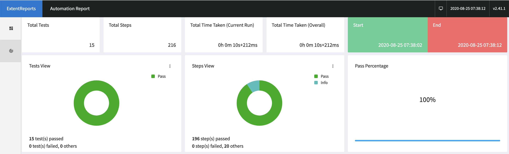

## Rest-AssuredAPITesting

### To run locally

Update the input->properties file with right api key and environment
Pass the environment variable like below before running through command line or from any IDE like eclipse
```-Denv=qa -Dtestng.dtd.http=true```

### Report Output

Using the extent report library the html report gets generated in the output folder

 
